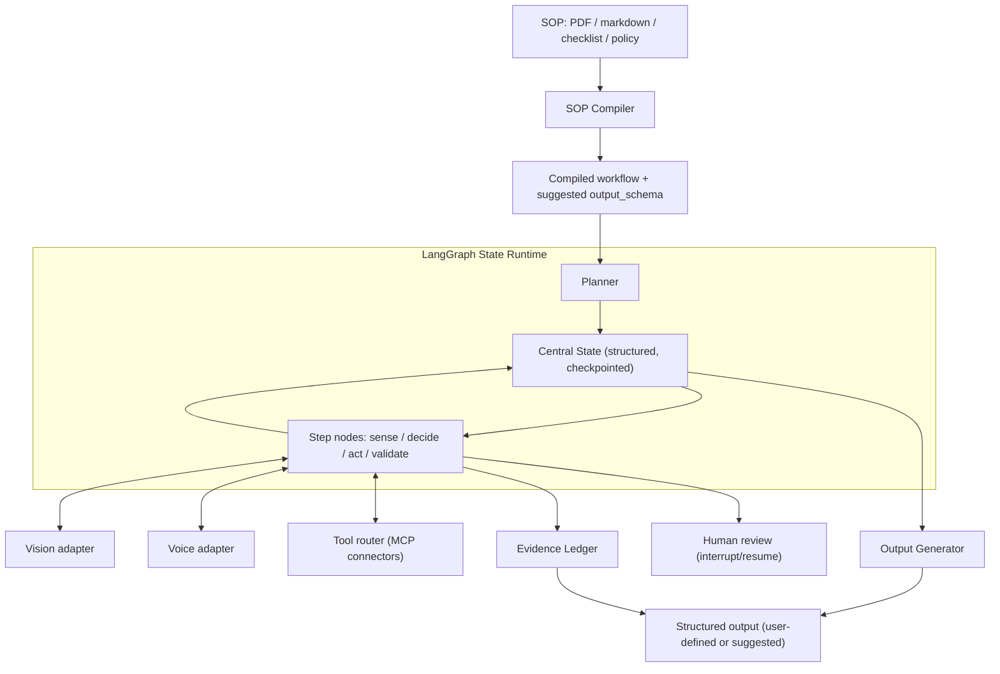
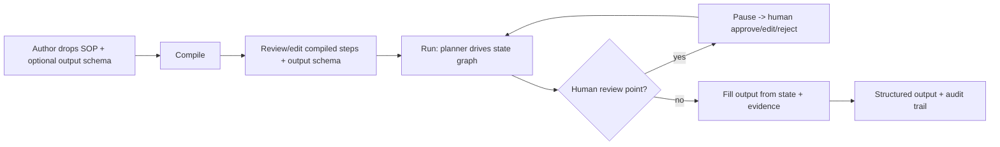

# SOPilot Architecture

> Condensed from the approved architecture plan. SOPilot is a generic,
> SOP-driven agent scaffold. The Cars24 "Jockey" inspection is **not** the
> source of patterns — it becomes one example you can run on SOPilot.

## Thesis

A user drops in an SOP (a checklist, policy PDF, runbook, or markdown). SOPilot
compiles it into an executable, stateful agent that can see, talk, and act
through tools/MCP, keeps a structured "thinking state," records evidence for
every conclusion, pauses for human approval on risky actions, and returns a
structured output the user defined (or that SOPilot suggested and they edited).
New use cases are **config + SOP, never core code**.

## Components and seams

| Module | Responsibility | Seam (ours, framework-agnostic) |
|---|---|---|
| `core/sop_compiler` | SOP → executable `CompiledWorkflow` | workflow JSON contract |
| `core/state_runtime` | typed central `State` + LangGraph graph + checkpointer | the `State` Pydantic schema |
| `core/planner` | execute steps, decisions, validation, confidence | — |
| `core/vision_adapter`, `core/voice_adapter` | sense/act | `Adapter` (`observe`/`act`/`capabilities`) |
| `core/tool_router` | MCP discovery + tool selection + calls | `MCPConnector` contract |
| `core/evidence_ledger` | append-only claim → evidence | `EvidenceRecord` |
| `core/human_review` | HITL via `interrupt` + auto-approve | `ReviewRequest`/`ReviewDecision` |
| `core/output_generator` | fill/suggest output schema from state + evidence | — |

LangGraph is imported **only** inside `core/state_runtime/graph.py` (graph +
checkpointer) and `core/planner/planner.py` (the `interrupt` call). Everything
else depends on our own contracts, so the runtime could be swapped (see
[ADR-0001](adr/0001-langgraph-as-state-runtime.md)).

## The central state ("thinking state")

Not chat history — a structured, versioned object every node reads/writes
(Pydantic model, persisted by the checkpointer). See
[state_schema.md](state_schema.md).

```json
{
  "goal": "complete_vehicle_inspection",
  "sop_version": "v1",
  "current_step": "capture_front_bumper",
  "completed_steps": [], "pending_steps": [],
  "observations": [], "evidence": [], "tool_results": [],
  "risks": [], "human_overrides": [], "final_output": null
}
```

## SOP compiler

Compiles the SOP into an executable workflow instead of passing it as context:

```json
{
  "steps": [], "required_evidence": [], "decision_points": [],
  "tools_needed": [], "validation_rules": [], "human_review_points": [],
  "output_schema": {}
}
```

LLM-driven but schema-constrained and re-runnable; ships with a **deterministic
local fallback** (markdown/checklist parsing + keyword/tag inference) so it runs
with no API keys. It can also **suggest** an `output_schema` when none is given.

## Evidence ledger

Every conclusion points to evidence — critical for inspections, insurance,
audits, KYC, compliance, and support. Append-only; output fields and decisions
reference ledger entries by id.

```json
{ "claim": "front bumper has medium scratch", "evidence": ["front_photo"],
  "model": "vision_model_x", "confidence": 0.86, "human_confirmed": true }
```

## Human-in-the-loop

High-risk actions pause the graph via a LangGraph `interrupt` (the checkpointer
persists state; resume after approve/edit/reject): final submit, document
rejection, valuation/price change, customer response, compliance failure. The
compiled SOP declares these as `human_review_points`; `core/human_review`
enforces them and provides an `AutoApprovePolicy` so non-interactive runs
complete while still exercising the real interrupt/resume path.

## Tool/MCP connector layer

A connector interface with MCP as the standard direction (servers expose tools,
resources, prompts). Need a CRM, DB, pricing API, doc extraction, or ticketing?
Add an MCP server. `core/tool_router` discovers servers and the planner selects
tools per `tools_needed`. No tools are hardcoded. See
[tool_connector_contract.md](tool_connector_contract.md).

## System diagram



## Authoring flow



## How a run actually executes (this implementation)

The graph has four nodes wired in `core/state_runtime/graph.py`:

```
START → plan → (execute | finalize)
execute → (review | plan)        # review iff the step declares a review point
review  → (plan | finalize)      # finalize iff rejected
finalize → END
```

- **plan** picks the next pending step (or routes to finalize when none remain).
- **execute** dispatches by modality (vision/voice → adapter, tool → router,
  reason/none → synthesized), records observations + evidence, runs validation
  rules, flags low-confidence as a risk, and applies decision points by taking
  the chosen branch and dropping the other.
- **review** emits a `ReviewRequest` via `interrupt(...)` and resumes with a
  `ReviewDecision`.
- **finalize** fills the output schema from state + evidence.

## Non-goals / notes

- `core/` is framework-agnostic at the seams so LangGraph could be swapped.
- Voice/vision are adapters, not the center — the platform is equally useful for
  headless, tool-only SOPs (see `support_runbook_agent`).
- See [docs/adr/](adr/) for the decision records and options assessment.
