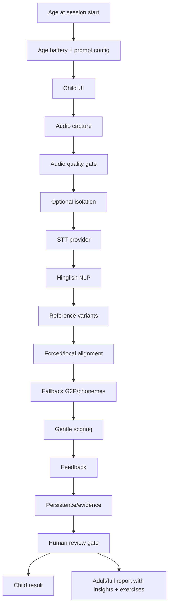

# Kids Voice Assessment Architecture

BoloBuddy Voice Assessment is a Hinglish-first SOPilot example for child-safe
voice practice and adult-facing evidence reports. It is designed for modern
Indian kids ages 3-8 using Indian English, Hindi, Hinglish, Hindi Latin script,
Hindi Devanagari, and code-switching within one utterance.

It is educational practice feedback, not a clinical diagnosis, IQ test, or
intelligence ranking.

## Why Hinglish-First

Many Indian children naturally code-switch: "Mera red ball table ke under hai",
"I went school, phir maine lunch khaya", or "आज I read a story". A generic
English pronunciation checker would over-penalize normal Indian/Hinglish speech.

The agent uses prompt-scoped variants, token language/script tags, and
mode-specific scoring so reading practice can be strict while expressive speaking
can accept configured semantic/code-switched equivalents.

## Architecture

Reusable modules live under `core.kids_voice_assessment`:

- `models.py`: typed state and data models.
- `providers.py`: `VoiceProvider`, `MockVoiceProvider`, `ElevenLabsVoiceProvider`.
- `hinglish_nlp.py`: normalization, token tagging, variants, token alignment.
- `phonemes.py`: fallback G2P and accent tolerance helpers.
- `scoring.py`: configurable gentle scoring.
- `feedback.py`: deterministic child/adult feedback.
- `reporting.py`: full educational report with insights and exercises.
- `pipeline.py`: deterministic SOP node orchestration.
- `graph.py`: LangGraph node wiring for the domain flow.
- `tools.py`: local MCP-style tool connector.
- `service.py`: API-equivalent service methods.

## SOPilot State Flow

The generic SOPilot `State` now has an optional `domain_state` payload for rich
typed domain state dumps. The kids assessment domain state is
`KidsVoiceAssessmentRunState`, composed of:

- `AssessmentState`
- `AudioState`
- `TranscriptState`
- `HinglishNlpState`
- `AlignmentState`
- `PhonemeState`
- `ScoreState`
- `FeedbackState`
- `ReviewState`
- `PrivacyState`
- `FullAssessmentReport`

Every major model output is recorded as evidence in the domain evidence ledger.
For age-selected batteries, the service runs the same typed pipeline once per
prompt, stores an `AssessmentTaskResult` for each task, then aggregates scores,
domain observations, review reasons, and exercises into one adult report.
The generic example SOP can still run through `python -m sopilot run`, while the
domain pipeline provides the production-shaped assessment behavior.

## ElevenLabs Usage

ElevenLabs remains behind `VoiceProvider`, but production assessment is
ElevenLabs-first. Local fixture mode is only for tests/demos. When production
real-provider mode is required, the pipeline fails closed if a fixture provider
is supplied.

Use cases:

- TTS prompt playback with pronunciation dictionaries.
- Scribe v2 STT with keyterms, language hints, and timestamps.
- Optional realtime STT for gentle UI state only.
- Audio Isolation when the noise score is low.
- Forced Alignment using reference text.
- Optional reward sound effects, disabled in tests.

Provider calls require:

- `ELEVENLABS_API_KEY`
- `ELEVENLABS_STT_MODEL_ID` defaulting to `scribe_v2`
- `ELEVENLABS_TTS_MODEL_ID`
- `ELEVENLABS_VOICE_ID_CHILD_FRIENDLY`
- `ELEVENLABS_VOICE_ID_PARENT`
- feature flags such as `ELEVENLABS_USE_AUDIO_ISOLATION`
- `privacy.external_provider_allowed: true`

Frontend code must never receive the API key. Realtime client token flows should
use short-lived server-issued tokens only.

## MCP Tools

`KidsVoiceLocalMCPConnector` exposes fixture tools for dry-runs:

- `mcp_hinglish_nlp`: normalize text, script tags, language tags,
  transliteration, variants, ASR artifact normalization, token comparison.
- `mcp_phoneme_g2p`: English IPA, Indian English variants, Hindi Devanagari,
  Hindi Latin, allophones, internal phone mapping, child-friendly labels.
- `mcp_pronunciation_assessment`: phoneme alignment, word/target sound scoring,
  fluency, pauses, completeness, age calibration, practice recommendations.
- `mcp_curriculum`: next prompt, prompt by skill, practice set,
  developmental level, next activity.
- `mcp_privacy_review`: consent, PII redaction, review case, audit event,
  deletion, parent report export.
- `mcp_elevenlabs_adapter`: fixture STT, isolation, alignment, TTS, reward sound,
  pronunciation dictionary upsert.

## Phoneme And G2P

MVP phoneme analysis is deterministic fallback G2P, not clinical phoneme
recognition. It supports small dictionaries and rules for Indian English,
Hinglish, Hindi Latin, and Hindi Devanagari.

Accent tolerance profiles include:

- `indian_english_default`
- `hindi_dominant_english_learner`
- `english_medium_school`
- `strict_phonics_practice`
- `hindi_phoneme_practice`

The default tolerates common Indian English variation unless the selected
practice target asks for strict scoring.

## Scoring

Scores are configurable by mode:

- word accuracy
- reference completeness
- phoneme accuracy
- target sound score
- fluency score
- pause score
- speaking confidence
- audio quality
- overall score
- educational domain insights
- exercises/practice plan

Child mode does not show percentages. Adult mode can show numeric scores,
evidence, and uncertainty. Low confidence routes to review rather than precise
child correction.

## Age Batteries

The service collects `age_years` at session creation and chooses from
`assessment_batteries.yaml`.

- Ages 3-4: short echo, naming, one-step directions.
- Ages 5-6: short sentence repetition, target sound practice, simple why
  questions.
- Ages 7-8: code-switch reading, story sequencing, longer auditory memory
  sentences.

Each prompt declares its domains, for example speech clarity, expressive
language, receptive language, vocabulary, attention, phonological awareness,
working memory, code-switch control, processing fluency, and story/reasoning.
These are learning-readiness and language observations only; they are not
clinical cognitive testing and not IQ scoring.

## Feedback

Feedback is template-first and deterministic. LLM feedback can be added later
behind a flag.

Child feedback:

- one sentence
- warm and simple
- no raw scores
- no diagnosis
- no technical IPA unless mapped to a child-friendly label

Adult feedback:

- evidence-backed
- includes uncertainty
- separates audio issues from pronunciation/reading evidence
- includes suggested practice
- says the result is educational, not clinical

## UI

The static UI demo in `examples/kids_voice_assessment_agent/ui/index.html` is
mobile-first, spacious, and calm:

- large mic button
- soft mascot shape
- listening waveform
- friendly retry card
- separate child and parent modes
- word timeline and score breakdown in parent mode
- no child raw scores

## Privacy

Privacy gates:

- consent required before saving audio
- raw and cleaned audio references kept separate
- `store_raw_audio=false` prevents raw URI persistence
- deletion clears recording URIs and marks state
- PII redaction tool available
- external providers blocked unless explicitly allowed
- audit events for persistence, external providers, and review access

## API Mapping

`KidsVoiceAssessmentService` maps to the requested API surface. `run_session`
automatically runs the full age battery when the session was created with
`age_years`; `run_battery_session` is also available for explicit per-task
audio/transcript inputs in tests and demos.

- `create_session(age_years=...)` -> `POST /api/kids-voice/sessions`
- `list_prompts` -> `GET /api/kids-voice/prompts`
- `list_prompts_for_age` -> `GET /api/kids-voice/prompts?age_years=...`
- `attach_audio` -> `POST /api/kids-voice/sessions/{session_id}/audio`
- `run_session` -> `POST /api/kids-voice/sessions/{session_id}/run`
- `get_result` -> `GET /api/kids-voice/sessions/{session_id}/result`
- `get_full_report` -> `GET /api/kids-voice/sessions/{session_id}/result?viewer_role=parent&full=true`
- `create_or_update_review` -> `POST /api/kids-voice/sessions/{session_id}/review`
- `delete_recording` -> `DELETE /api/kids-voice/recordings/{recording_id}`
- `child_progress` -> `GET /api/kids-voice/children/{child_id}/progress`

## MVP Limitations

MVP supports age-based word/sentence/expressive assessment, Hinglish
normalization, basic token tags, a real ElevenLabs provider adapter, fixture-only
demo provider, forced-alignment adapter seam, fallback G2P, scoring, feedback,
full reports, privacy, human review, and a static UI demo.

MVP does not claim perfect phoneme recognition, clinical-grade assessment,
IQ measurement, robust child ASR in noisy classrooms, support for all Indian
languages, or reliable diagnosis of speech disorders.

## Roadmap

- Fine-tuned child speech models.
- Local CTC alignment.
- Stronger phoneme recognizer.
- Classroom mode.
- Specialist mode.
- Progress dashboard.
- Adaptive curriculum.
- On-device low-latency mode.
- Richer Hindi phoneme coverage.
- Guided conversational practice with ElevenLabs Agents outside core scoring.
